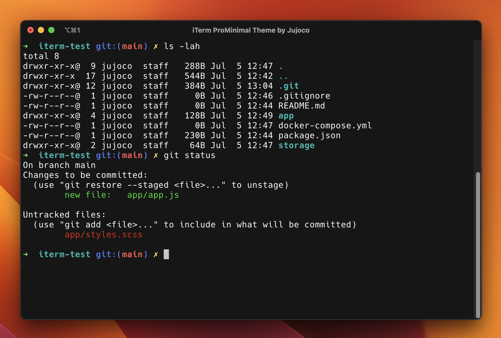

  

<h3 align="center">
	ProMinimal Theme for <a href="https://iterm2.com">iTerm</a>
</h3>

## Preview

ProMinimal

## Usage

1. Clone the repository, or
   [download](https://github.com/jujoco/iterm-ProMinimal/tree/main/themes) the raw theme file.
2. Launch iTerm
3. Press CMD+i (⌘+i)
4. Navigate to the **Profiles** > **Colors** tab
5. Click on **Color Presets**
6. Click on **Import**
7. Navigate to the directory where you downloaded the theme file, and select the
   file.
   \
   If you cloned the repo, the file is in the `themes/` directory.
8. Click on **Color Presets** again and choose ProMinimal.
9. Enjoy! :sparkles:

&nbsp;

Copyright &copy; 2023-present by <a href="https://github.com/jujoco" target="_blank">Jujoco</a>

